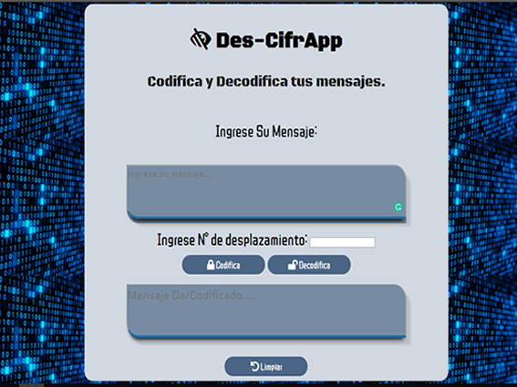

# DeCifrApp

DesCifrApp es una aplicación que permite la codificación o decodificación de mensajes a través del método de cifrado césar que es una de las técnicas más simples para cifrar un mensaje. Es un tipo de cifrado por sustitución, es decir que cada letra del texto original es reemplazada por otra que se encuentra un número fijo de posiciones (desplazamiento) más adelante en el mismo alfabeto.
Por ejemplo, si usamos un desplazamiento (_offset_) de 3 posiciones:
- La letra A se cifra como D.
- La palabra CASA se cifra como FDVD.
- Alfabeto sin cifrar: A B C D E F G H I J K L M N O P Q R S T U V W X Y Z
- Alfabeto cifrado: D E F G H I J K L M N O P Q R S T U V W X Y Z A B C

## Pre-requisitos e instalación
1. Antes que nada, asegúrate de tener un editor de texto en
   condiciones, algo como [Atom](https://atom.io/), 
   [Visual Code](https://code.visualstudio.com/), [Sublime Text](https://www.sublimetext.com) o cualquier otro de tu preferencia.
2. Para ejecutar los comandos a continuación necesitarás una
   [UNIX Shell](https://github.com/Laboratoria/curricula-js/tree/v2.x/topics/shell),
   que es un programita que interpreta líneas de comando (command-line
   interpreter) así como tener [git](https://github.com/Laboratoria/curricula-js/tree/v2.x/topics/scm/01-git)
   instalado. Si usas un sistema operativo "UNIX-like", como GNU/Linux o MacOS,
   ya tienes una _shell_ (terminal) instalada por defecto (y probablemente `git`
   también). Si usas Windows puedes usar [Git bash](https://git-scm.com/download/win),
   aunque recomendaría que consideres probar GNU/Linux como tu Sistema Operativo.
3. Haz tu propio [fork](https://help.github.com/articles/fork-a-repo/)
   de [ este repositorio](https://github.com/Champy13/cdmx-2019-01-bc-core-am-cipher) de tu cohort, tus _coaches_ te compartirán un _link_ a un repositorio y te 
   darán acceso de lectura en ese repo.
4. [Clona](https://help.github.com/articles/cloning-a-repository/)
   tu _fork_ a tu computadora (copia local).
5. Instala las dependencias del proyecto con el comando `npm
   install`. Esto asume que has instalado [Node.js](https://nodejs.org/) (que
   incluye [npm](https://docs.npmjs.com/)).
6. Si todo ha ido bien, deberías poder ejecutar las :traffic_light:
   pruebas unitarias (unit tests) con el comando `npm run test`.

## Consideraciones técnicas

Este proyecto está desarrollado con:
- EMS6 JavaScriptpuro [JSVanilla](https://medium.com/laboratoria-developers/vanillajs-vs-jquery-31e623bbd46e).
-CSS3
-HTML5
- Se realizaron [pruebas unitarias]() para validar la funcionalidad de codificación y decodificación. 
  Estos test se implementaron con [Mocha](https://mochajs.org/) y assertion library de [Chai](https://www.chaijs.com/).
- Como gestor de proyecto de utilizó NPM (Node Package Manager).

## Testing & Guías de Estilo
Las pruebas automatizadas para este sistema requieren de una instalación simple a través del comando npm install. Los tests verifican que regrese una letra acorde a la posición ingresada en el offset. 

Analiza que la función  cifrar retorne "HIJKLMNOPQRSTUVWXYZABCDEFG" para "ABCDEFGHIJKLMNOPQRSTUVWXYZ" con offset 33; y que la función decifrar retorne retornar "ABCDEFGHIJKLMNOPQRSTUVWXYZ" para "HIJKLMNOPQRSTUVWXYZABCDEFG" con offset 33. No cifra caracteres especiales y espacios (" !@" debería retornar  " !@"', ).

El _boilerplate_ contiene una estructura de archivos como punto de partida así
como toda la configuración de dependencias y tests de ejemplo:
```text
./
├── .editorconfig
├── .eslintrc
├── .gitignore
├── README.md
├── package.json
├── src
│   ├── cipher.js
│   ├── index.html
│   ├── index.js
│   └── style.css
└── test
    ├── cipher.spec.js
    ├── headless.js
    └── index.html
```
El _boilerplate_ incluye tareas que ejecutan [eslint](https://eslint.org/) y
[htmlhint](https://github.com/yaniswang/HTMLHint) para verificar el `HTML` y
`JavaScript` con respecto a una guías de estilos. Ambas tareas se ejecutan
automáticamente antes de ejecutar las pruebas (tests) cuando usamos el comando
`npm run test`. En el caso de `JavaScript` estamos usando un archivo de
configuración de `eslint` que se llama `.eslintrc` que contiene un mínimo de
información sobre: qué version de JavaScript/ECMAScript, el
entorno (browser en este caso) y las [reglas recomendadas (`"eslint:recommended"`)](https://eslint.org/docs/rules/).
En cuanto a reglas/guías de estilo en sí,
usaremos las recomendaciones _por defecto_ de tanto `eslint` como `htmlhint`.
## Autores
- Erandi Cuervo 
## Expresiones de gratitud
Agradezco el apoyo de mi squad "Guacacoders".  
# UX-UI
## Usuario
Cliente modelo:

Carla Cervantes es una joven de 17 años que busca una manera de enviar mensajes a su novio, amigos etc y que únicamente ellos puedan saber la manera de descifrarlos. El motivo por el que tiene esta necesidad es debido a que ocasionalmente a sorprendido a su hermana menor tomando su celular y leyendo sus conversaciones, lo que le ha generado problemas con su mamá pues la ha acusado en repetidas ocasiones de algunos planes que ha hecho sin el consentimiento de sus padres.


## Interface
El usuario ingresa el mensaje que desee cifrar o descifrar, el mensaje puede incluir mayúsculas, minúsculas, espacios, números etc...Posteriormente puede elegir número de espacios que se va a implementar como ( offset ) saltos que se darán en el alfabeto.

## Bocetos 

En un principio no estaba claro si se iba a implementar una caja de texto para cifrar, otra para descifrar y una donde se mostrara el resultado, también se sugería que la forma del botón fuera rectangular en el primer bosquejo solo existía un botón y el offset se decidía en el inicio de la pag .

Posteriormente se decidió tener una caja de texto donde se ingrese el texto ya sea para cifrar o descifrar y se encuentra otra donde se muestra el resultado, se optó por 2 botones uno para cada acción y al final uno que limpie los campos.


## Muestra Final

El resultado final ayuda a nuestro usuario a dar solución a su problema con solo ingresar a esta aplicación donde lo único que necesita es ingresar el texto y el número de desplazamientos que desee, obtendrá un mensaje codificado que solo podrá leer la persona que cuente con la información necesaria para el decodificado del mensaje, haciendo que sus conversaciones tengan un mayor grado de seguridad.



## -Intrucciónes de uso

Para Cifrar:

- Ingresar texto a cifrar.
- Elegir un offset de desplazamiento.
- Oprime boton "Codificar".
- Recibe tu mensaje codificado.
- Oprime boton "limpiar" para refrescar y volver a utilizar.

Para Descifrar:

- Ingresar texto a descifrar.
- Elegir un offset de desplazamiento (el mismo que se utilizo para codificar).
- Oprime boton "decodifica tu mensaje".
- Recibe tu mensaje decodificado.
- Oprime boton "limpiar" para refrescar y volver a utilizar.


# Enlace Deploy

[Sitio Terminado](https://champy13.github.io/cdmx-2019-01-bc-core-am-cipher/src/)

